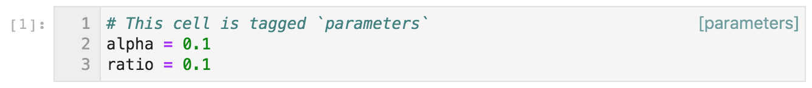

# jupyterlab-show-cell-tags


Show cell tags in the JupyterLab notebook interface.



## Requirements

* JupyterLab >= 2.0

## Install

```bash
jupyter labextension install jupyterlab-show-cell-tags
```

## Contributing
To set up for development:

```bash
# Clone the repo to your local environment
# Enter jupyterlab-show-cell-tags directory

# Install dependencies
jlpm
# Build TypeScript source
jlpm build
# Link your development version of the extension with JupyterLab
jupyter labextension install .
# Rebuild TypeScript source after making changes
jlpm build
# Rebuild JupyterLab after making changes
jupyter lab build
```
The `jlpm` command is JupyterLab's pinned version of
[yarn](https://yarnpkg.com/).
You may use `yarn` or `npm` instead.

You can watch the source directory and run JupyterLab in watch mode to watch for changes in the extension's source and automatically rebuild the extension and application:

```bash
# In one terminal, rebuild the extension whenever it changes
jlpm watch
# In another, run JupyterLab and rebuild it whenever the extension is built
jupyter lab --watch
```

Now every change will be built locally and bundled into JupyterLab.
Be sure to refresh your browser page after saving file changes to reload the extension (note: you'll need to wait for webpack to finish, which can take 10s+ at times).

To uninstall the extension:

```bash
jupyter labextension uninstall jupyterlab-show-cell-tags
```
